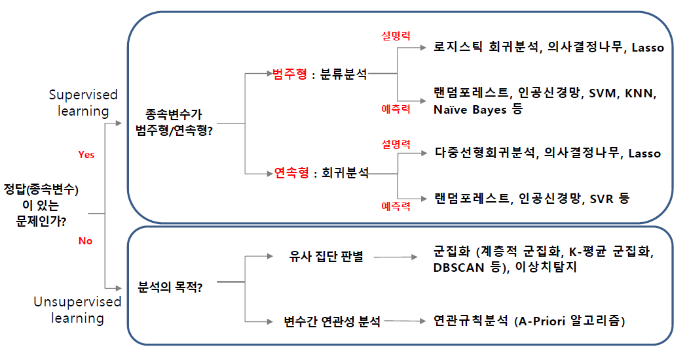

<style>
body{
     font-family: 나눔바른고딕;
}
</style>

```{r setup, echo=F}
knitr::opts_chunk$set(eval = F)
```

# R 기반의 데이터 마이닝 정리


설명력 위주 모형 : 통계모형으로 예측력은 떨어지나 모형을 이해하기 좋음 

- X ~ Y 의 인과관계를 얼마나 설명하는지 즉 $R^2$

- 통계 모델은 주로 선형이므로 오버피팅을 무시해도됨. 즉 $R^2$가 중요

예측력 위주 모형 : 예측력은 뛰어나지만 이해와 해석이 어려움 

- 미래의 Y값을 얼마나 잘 예측하는지로 마땅차한 기준 X

- 머신러닝은 비선형 모델델

## 예측력 모형의 모형 비교 기준 : 회귀모형

에측력 모형은 train set과 test set을 분할하여 overfiting 막음

아래의 기준들은 전부 test data를 사용해 계산함


### 예측 결정계수 $R^2$

$$R^2=corr(y,  \hat y )^2$$

### 평균절대오차 MAE : 절대적인 오차의평균을 이용

$$MAE = {1 \over n} \sum |y - \hat y |$$

### Mean absolute percentage error MAPE : 실제값 대비 얼마나 예측값이 차이가 있었는지 %로 표현

$$MAPE = {100\% \over n} \sum {|y - \hat y | \over |y|}$$

### Mean squred error MSE : 절대값이 아닌 제곱을 취한 지표

$$MAPE = {100\% \over n} \sum (y - \hat y )^2$$

## 예측력 모형의 모형 비교 기준 : 분류모형

### Accuracy 계열


모형 작성시 : sensitivity(TPR), specificity(TNR)
현장 적용시 : PPV, NPV

- 정확도 : $a+d \over a+b+c+d$

- 민감도 : TPR

- 특이도 : TNR

- 정밀도 : PPV

- F-1 score : TPR과 PPV의 조화평균

- BCR : TPR과 TNR의 기하평균 


단점 : 작위성이 있다 (측도에 따라,  cut-off에 따라 순위변동 가능)

### ROC 계열

같은 기술이라면 특이도와 민감도는 반비례관계

x축 : 1-특이도
y축 : 민감도

AUROC : area under the ROC curve

일반적올 75%이상임년 적당하고 80%이상이면 좋음, 최소 65% 이상이어야함

### Lift Chart 계열
발생확률이 작은 순으로 정렬 후 10(또는 다른)구간화
X : 구간화된 sample size
Y : 반응률 Response 또는 반응검출률 Captured Response 또는 향상도 Lift

반응률 Response : 상위등급이 높게나오고 급락하면 good
향상도 Lift : 상위등급은 1보다 크고, 하위등급은 0에 가까울수록 good

갑자기 오르거나 내리는등 일관되지 않은 부분이 존재하여 cumulative 선호

누적 반응률 Response : 경사가 급하면 좋고, unif하면 나쁨
누적 향상도 Lift : 1로 하강하며 상위등급이 클수록 good
뉴적 반응 검출률 captured response : 유일하게 상승

3가지중 어느것 사용하나 결과는 동일

Cumulative accruacy profile CAP : 지니계수 개념 (클수록 좋음)

완벽한 분류시스템 누적반응검출률 면적 - 모형의 누적반응검출률 면적   /
완벽한 분류시스템 누적반응검출률 면적 - 랜덤한 누적반응검출률 면적

이를 이용해 Profit chart도 가능 : maximize profit = income - cost

### K-S 통계량량

불량 누적분포와 우량 누적분포의 차이가 가장 큰 값 : 차이가 클수록 좋음


cf. 이론적 분포함수 : 누적분포함수,  실제 data의 분포함수 : rudgjaqnsvhgkatn


# Regression

## 모형 만들시 유의사항

### 간섭효과 comfuounding effect 제거 방안

1. 통제 control : 상수화 -> 일정하게 고정

1. 데이터 확장 : X변수 추가 수집 -> 간섭효과를 양성화


### 범주형 독립 변수

지시변수 사용 : 0 또는 1


## 모형 해석

### 기울기 $\beta$

수학적 해석보다는 실무적 해석이 중요

절편은 데이터 범위를 벗어난 경우 의미없으므로 해석하지 않는다.

### 모수$\beta$의 p-value : 기울기 유의성 검정

p-value가 0.05보다 작으면 $H_0 : \beta =0$을 기각 : 즉 유의한 기울기


### 결정계수 $R^2$

Y의 총 변동량 중에서 X에 의해서 설명된 분량 : 즉 회귀모형의 설명력

$R^2$이 1에 가까울 수록 완전히 설명

Adjusted $R^2$ : X변수의 수가 많을수록 좋아지는 $R^2$의 문제를 반영 (overfitting 막음)


### 모형의 p-value : 회귀모형의 유효성

p-value가 0.05보다 작으면 $H_0 : all \ \beta_i =0$을 기각 : 즉 적어도 하나 이상의 설명변수가 유의하다


$R^2$와 p-value의 관련성

- 높은 $R^2$, 낮은 p-value : 데이터 품질이 높은 경우

- 낮은 $R^2$, 낮은 p-value : X변수 추가 발굴 (금융 데이터)

- 낮은 $R^2$, 높은 p-value :유의하지 않은 X변수로 구성된 회귀분석

- 높은 $R^2$, 높은 p-value : 불가능

의학 약학 분야와 같이 실험데이터는 인과관계 단순 : $R^2$ 높게 나옴

금융 겡제 분야와 같이 관찰 데이터는 많은 변수와 인과관계 복잡 : $R^2$ 낮게 나옴

따라서 $R^2$는 분야별 유연한 기준 필요


## 모형의 타당성 검토

선형회귀의 기본 가정 : p-value 계산시 F분포를 이용하기에 필요 (가정없이 $R^2$나 기울기 단순 계산은 가능)

- 정규성 : 오차항의 분포가 평균이 0인 정규성

- 등분산성 : 오차항의 분산이 동일

- 독립성 : 오차항들이 서로 독립

모형 추정 후 오차의 추정치인 잔차를 통해 위의 가정들을 검토 가능

- 잔차분석

- 회귀분석

### 정규성

normal QQ plot

### 등분산성 

$\hat{y}$에 따른 잔차 그래프(residuals plot)가 메가폰 형태 같은 것이 없어야 한다.

$\hat{y}$ 증가시 $R^2$ 상승의 경우 Y변수 변환 필요 : log(or sqrt) scaling

분산은 일정하나 $\hat{y}$ 증가시 추세가 존재할 경우 추가 X변수 발굴 필요

## 모형 고급화 방법

$R^2$ 증가 방법 : 유의한 X변수 발굴, 독립적이고 다양할수록 유리, 범주형 X변수의 교호작용

### 변수 선택

중요한 소수의 예측변수를 찾아낸는 것이 중요 : 일반적으로 AIC 기준

- all subsets
- backwrd elimination
- forward selection
- stepwise elimination


## 기타

trellis plot : 범주별 그래프


```{r}
library(lattice)
mypanel <- function(x, y) {
  panel.xyplot(x, y)
  panel.loess(x, y, col="red", lwd=2, lty=2)
  panel.lmline(x, y, col="black", lwd=2, lty=3)
}
xyplot(Price~Odometer|Color,data=usedcar2,panel=mypanel)
# color라는 범주별 그래프를 그려줌
```


가법모형 : 더하기만 있는 형태로 곱하기는 없음

승법모형 : 교호작용과 상호작용 포함
    - 고차(교호작용)가 유의하면 저차가 유의하지 않아도 포함 : 즉 교호작용이 유의하면 main effect에서 유의하지 않아도 포함
    
    
참고로 $X$와 $X^2$ 사이의 다중 공산성은 거의 없음 : 다중 공산성은 직선의 관계에서 강하게 발생


# Logistic Regression

설명력위주의 분류분석 : 종속변수가 범주형 변수

입력변수가 범주형인경우 one-hot encoding을 통해 지시변수로 사용 가능

$$logit \ P(y=i)=\beta_0 + \beta_1 x$$


시그모이드 함수는 비선형이나 cut-off에 따른 분류경계선 자체는 선형이므로 선형모델임

(GLM : 초평면에서 선형이 나타나기 떄문)

cut-off기준 : 일반적으로 0.5이나, 불균형자료(imbalanced data)의 경우 P(y=1)가 cut-off값이 됨

로지스틱 회귀분석의 추정 방법 : MLE

```{r}
full_model = glm(RESPOND~AGE+BUY18+CLIMATE+FICO+INCOME+MARRIED+OWNHOME+GENDER,
                 family="binomial",data=directmail1)

# family="binomial" : 변수과 0과 1임을 알려줌 (생략시 정규분포로 선형회귀분석이 실시됨)
```

```{r}
predict(step_model, newdata=smith, type='response')
#reponse가 확률을 예측 해줌
```


## 모형 해석

### $\beta$

$X_1$이 1 커지면 $e^{\beta_1}$배 만큼 오즈가 변함 : 오즈비 개념


### $\beta$의 p-value

### AUROC

$R^2$가 없으므로, 대신 AUROC 사용

### deviance의 p-value

모형의 유의성 확인으로 null model의 deviance와 fitted model의 deviance 비교


# Decision Tree
분류나무(분류분석)와 회귀나무(회귀분석) 2가지 존재

로지스틱 모형에 비해 더 계산이 빠름 : 신속한 판단 가능

의사결정나무는 전체 데이터 집합을 partition

입력변수가 범주형이면 의사결정 나무 유리 : Decision tree는 교호작용을 찾는데 탁월
(로지스틱 회귀분석은 교호작용의 있을 경우 해석이 어려움)


R에서 범주형 변수는 자동으로 지시변수로 변환되나, baseline을 미리 지정하는 것이 좋음


## Papular argorithms
CHART
CHAID
Exhaustive CHAID
QUEST
C5
CRUISE


# Neural Network

# Ensemble Methods

# Random Forest

# Unsupervised Learnging - clustering


