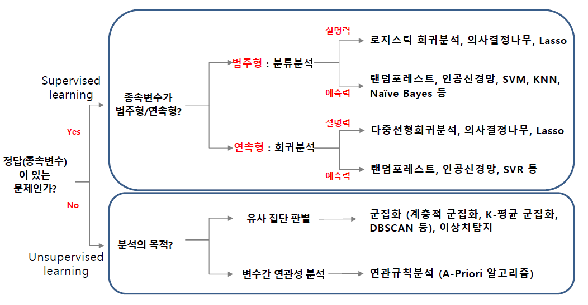
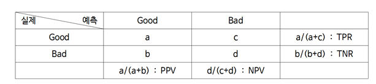

<style>
body{
     font-family: 나눔바른고딕;
}
</style>

```{r setup, echo=F}
knitr::opts_chunk$set(eval = F)
```

# R 기반의 데이터 마이닝 정리



설명력 위주 모형 : 통계모형으로 예측력은 떨어지나 모형을 이해하기 좋음 

- X ~ Y 의 인과관계를 얼마나 설명하는지 즉 $R^2$

- 통계 모델은 주로 선형이므로 오버피팅을 무시해도됨. 즉 $R^2$가 중요

예측력 위주 모형 : 예측력은 뛰어나지만 이해와 해석이 어려움 

- 미래의 Y값을 얼마나 잘 예측하는지로 마땅차한 기준 X

- 머신러닝은 비선형 모델델

## 예측력 모형의 모형 비교 기준 : 회귀모형

에측력 모형은 train set과 test set을 분할하여 overfiting 막음

아래의 기준들은 전부 test data를 사용해 계산함


### 예측 결정계수 $R^2$

$$R^2=corr(y,  \hat y )^2$$

### 평균절대오차 MAE : 절대적인 오차의평균을 이용

$$MAE = {1 \over n} \sum |y - \hat y |$$

### Mean absolute percentage error MAPE : 실제값 대비 얼마나 예측값이 차이가 있었는지 %로 표현

$$MAPE = {100\% \over n} \sum {|y - \hat y | \over |y|}$$

### Mean squred error MSE : 절대값이 아닌 제곱을 취한 지표

$$MAPE = {100\% \over n} \sum (y - \hat y )^2$$

## 예측력 모형의 모형 비교 기준 : 분류모형

### Accuracy 계열


모형 작성시 : sensitivity(TPR), specificity(TNR)
현장 적용시 : PPV, NPV

- 정확도 : $a+d \over a+b+c+d$

- 민감도 : TPR

- 특이도 : TNR

- 정밀도 : PPV

- F-1 score : TPR과 PPV의 조화평균

- BCR : TPR과 TNR의 기하평균 


단점 : 작위성이 있다 (측도에 따라,  cut-off에 따라 순위변동 가능)

### ROC 계열

같은 기술이라면 특이도와 민감도는 반비례관계

x축 : 1-특이도
y축 : 민감도

AUROC : area under the ROC curve

일반적올 75%이상임년 적당하고 80%이상이면 좋음, 최소 65% 이상이어야함

### Lift Chart 계열

발생확률이 작은 순으로 정렬 후 10(또는 다른)구간화

X : 구간화된 sample size

Y : 반응률 Response 또는 반응검출률 Captured Response 또는 향상도 Lift

반응률 Response : 상위등급이 높게나오고 급락하면 good

향상도 Lift : 상위등급은 1보다 크고, 하위등급은 0에 가까울수록 good

갑자기 오르거나 내리는등 일관되지 않은 부분이 존재하여 cumulative 선호


- 누적 반응률 Response : 경사가 급하면 좋고, unif하면 나쁨

- 누적 향상도 Lift : 1로 하강하며 상위등급이 클수록 good

- 뉴적 반응 검출률 captured response : 유일하게 상승

3가지중 어느것 사용하나 결과는 동일


Cumulative accruacy profile CAP : 지니계수 개념 (클수록 좋음)

완벽한 분류시스템 누적반응검출률 면적 - 모형의 누적반응검출률 면적   /
완벽한 분류시스템 누적반응검출률 면적 - 랜덤한 누적반응검출률 면적

이를 이용해 Profit chart도 가능 : maximize profit = income - cost

### K-S 통계량량

불량 누적분포와 우량 누적분포의 차이가 가장 큰 값 : 차이가 클수록 좋음


cf. 이론적 분포함수 : 누적분포함수,  실제 data의 분포함수 : rudgjaqnsvhgkatn


# Regression

## modeling 유의사항

1. 간섭효과 comfuounding effect 제거 방안

- 통제 control : 상수화 -> 일정하게 고정

- 데이터 확장 : X변수 추가 수집 -> 간섭효과를 양성화


2. 범주형 독립 변수

지시변수 사용 : 0 또는 1


## 모형 해석

1. 기울기 $\beta$

수학적 해석보다는 실무적 해석이 중요

절편은 데이터 범위를 벗어난 경우 의미없으므로 해석하지 않는다.

2. 모수$\beta$의 p-value : 기울기 유의성 검정

p-value가 0.05보다 작으면 $H_0 : \beta =0$을 기각 : 즉 유의한 기울기


3. 결정계수 $R^2$

Y의 총 변동량 중에서 X에 의해서 설명된 분량 : 즉 회귀모형의 설명력

$R^2$이 1에 가까울 수록 완전히 설명

Adjusted $R^2$ : X변수의 수가 많을수록 좋아지는 $R^2$의 overfitting의 문제를 반영

4. 모형의 p-value : 회귀모형의 유효성

p-value가 0.05보다 작으면 $H_0 : all \ \beta_i =0$을 기각 : 즉 적어도 하나 이상의 설명변수가 유의하다


cf. $R^2$와 p-value의 관련성

- 높은 $R^2$, 낮은 p-value : 데이터 품질이 높은 경우

- 낮은 $R^2$, 낮은 p-value : X변수 추가 발굴 (금융 데이터)

- 낮은 $R^2$, 높은 p-value :유의하지 않은 X변수로 구성된 회귀분석

- 높은 $R^2$, 높은 p-value : 불가능

의학 약학 분야와 같이 실험데이터는 인과관계 단순 : $R^2$ 높게 나옴

금융 겡제 분야와 같이 관찰 데이터는 많은 변수와 인과관계 복잡 : $R^2$ 낮게 나옴

따라서 $R^2$는 분야별 유연한 기준 필요


## 모형의 타당성 검토

선형회귀의 기본 가정 : p-value 계산시 F분포를 이용하기에 필요 (가정없이 $R^2$나 기울기 단순 계산은 가능)

- 정규성 : 오차항의 분포가 평균이 0인 정규성

    - normal QQ plot

- 등분산성 : 오차항의 분산이 동일

    - $\hat{y}$에 따른 잔차 그래프(residuals plot)가 메가폰 형태 같은 것이 없어야 한다.

    - $\hat{y}$ 증가시 $R^2$ 상승의 경우 Y변수 변환 필요 : log(or sqrt) scaling

    - 분산은 일정하나 $\hat{y}$ 증가시 추세가 존재할 경우 추가 X변수 발굴 필요

    
- 독립성 : 오차항들이 서로 독립


잔차 분석 : 모형 추정 후 오차의 추정치인 잔차를 통해 위의 가정들을 검토 가능 


## 모형 고급화 방법

1. $R^2$ 증가 방법

유의한 X변수 발굴

독립적이고 다양한 X변수일 수록 유리

범주형 X변수의 교호작용 반영


2. 변수 선택

중요한 소수의 예측변수를 찾아낸는 것이 중요 : 일반적으로 AIC 기준

- all subsets

- backwrd elimination

- forward selection

- stepwise elimination


## trellis plot : 범주별 그래프


```{r}
library(lattice)
mypanel <- function(x, y) {
  panel.xyplot(x, y)
  panel.loess(x, y, col="red", lwd=2, lty=2)
  panel.lmline(x, y, col="black", lwd=2, lty=3)
}
xyplot(Price~Odometer|Color,data=usedcar2,panel=mypanel)
# color라는 범주별 그래프를 그려줌
```


## 가법모형과 승법모형

가법모형 : 더하기만 있는 형태로 곱하기는 없음

승법모형 : 교호작용과 상호작용 포함

    - 고차(교호작용)가 유의하면 저차가 유의하지 않아도 포함 : 즉 교호작용이 유의하면 main effect에서 유의하지 않아도 포함

    - 참고로 $X$와 $X^2$ 사이의 다중 공산성은 거의 없음 : 다중 공산성은 직선의 관계에서 강하게 발생


# Logistic Regression

설명력위주의 분류분석 : 종속변수가 범주형 변수


입력변수가 범주형인경우 one-hot encoding을 통해 지시변수로 사용 가능


NA가 많은 경우 사용 불가능


$$logit \ P(y=i)=\beta_0 + \beta_1 x$$


시그모이드 함수는 비선형이나 cut-off에 따른 분류경계선 자체는 선형이므로 선형모델임

- 따라서 오분류가 많이 발생 가능

(GLM : 초평면에서 선형이 나타나기 떄문)

cut-off기준 : 일반적으로 0.5이나, 불균형자료(imbalanced data)의 경우 P(y=1)가 cut-off값이 됨

로지스틱 회귀분석의 추정 방법 : MLE

```{r}
full_model = glm(RESPOND~AGE+BUY18+CLIMATE+FICO+INCOME+MARRIED+OWNHOME+GENDER,
                 family="binomial",data=directmail1)

# family="binomial" : 변수과 0과 1임을 알려줌 (생략시 정규분포로 선형회귀분석이 실시됨)
```

```{r}
predict(step_model, newdata=smith, type='response')
#reponse가 확률을 예측 해줌
```


## 모형 해석

1. $\beta$

$X_1$이 1 커지면 $e^{\beta_1}$배 만큼 오즈가 변함 : 오즈비 개념


2. $\beta$의 p-value

3. AUROC

$R^2$가 없으므로, 대신 AUROC 사용

4. deviance의 p-value

모형의 유의성 확인으로 null model의 deviance와 fitted model의 deviance 비교


# Decision Tree

분류나무(분류분석)와 회귀나무(회귀분석) 2가지 존재


의사결정나무는 전체 데이터 집합을 partition


R에서 범주형 변수는 자동으로 지시변수로 변환되나, baseline을 미리 지정하는 것이 좋음


장점

- 로지스틱 모형에 비해 더 계산이 빠름 : 신속한 판단 가능

- 단변량 분할 one varaiable at a time

    - small n, large p data 가능

    - missing value가 있을 때 영향 최소화

-범주형 X변수 처리 용이

    - 지시변수 불필요

- 입력변수가 범주형이면 의사결정 나무 유리 : Decision tree는 교호작용을 찾는데 탁월

    - (로지스틱 회귀분석은 교호작용의 있을 경우 해석이 어려움)


- 범주들의 대범주화 : 타 분석방법에 앞서 전처리 과정으로 사용가능

- 해성의 용이성 : 이해하기 쉬운 규칙을 생성

- Y 변수

    - 범주형 변수와 연속형 변수 모두 처리 가능
    - 소수 그룹에 용이한 처리

- X 변수

    - 교호작용의 파악
    - 변수개수에 영향을 덜받음
    - 변수의 중요도 파악
    - X변수 선택 기능 -> 신경망 등에 사용
    - 이상치에 둔감
    - 결측치의 영향 적음
    - 범주형 X변수의 처리 용이
    - 범주형 X변수의 범주개수 감축
    
    
단점

- 분류경계선 hyperplabne 근처에서는 오분류 가능

- 다른 방법에 비해 분류 정확도(예측도)가 낮을 수 있음
 


간단한 모형일수록 설명력 높고 예측력 낮다. underfitting

복잡한 모형일수록 설명력 낮고 예측력 높다. 하지만 너무 복잡하면 overfitting일 수 있다. : 완전히 성장한 나무의 오분류율은 overfitting 되기 쉬움


data를 크게 3개로 분할
training data
pruning data : 로지스틱이나 neural network랑 다르게 필요
test data


## Papular argorithms
CHART
CHAID
Exhaustive CHAID
QUEST
C5
CRUISE


## CART 의사결정 나무

binary decisuion rule : 노드가 항상 2개로 분할

숫자형 X변수의 경우 부등호 사용, 범주형 X변수의 경우 부분집합 포함 여부 사용

divide and conqure approach : 분할과 계산 사용

greedy serach using impurity measure : 불순도 이용하여 탐욕적 serach

one variable at a time : 매 분할마다 하나의 X변수만 사용

### 분할 방법 : 불순도 측정

1. 불순도 함수

1.1.  Gini impurity 지니 불순도 : $1-\sum^{K}_{j=1} P_j^2$

where K : Y의 범주 개수, $P_i$ i번째 범주에 포함될 확률

완전히 균일분포($all\ P_i =1/K$)이면 지니불순도 최댓값 0.5
지니 불순도의 최솟값은 0으로 불순도가 작을수록 좋음

1.2. 엔트로피 Entropy : $-\sum^{K}_{j=1} P_j log(P_j)$

1.3 이탈도 Deviance : $-2\sum^{K}_{j=1} n_j log(P_j)$

2. 불순도 측정

분할 이전의 노드의 불순도와, 분할후 각각의 노드별 불순도를 측정

각 노드별 데이터 수에 따라 가중평균하여 분할 이후와 이전이 불순도가 감소했는지를 측정

3. 분할

여러개의 분할에 따른 불순도 감소 정도를 비교

greedy search를 통해 최적의 분할을 찾음 : 여러개의 변수 모두 공정한 동일한 기회고 전부 무차별 대입을 통해 구해봄(최종 선정은 1개의 기준으로만)


### CART stopping criteria : 조정할 수 있는 parameter

1. 최대 깊이 조정 maxdepth : set the maximum depth of any node of the final tree

2. 최소 노드크기 조정 minsplit : set the minimum nuber of observations that must exist in a node

3. 최소 향상도 조정 cp : complexity parmeter 분할시 최소한으로 작아져야 하는 불순도

maxdepth가 클수록, minsplit과 cp가 작을수록 tree가 커짐짐


```{r}
library(rpart)
library(rpart.plot)
# default tree
tree0 <- rpart(BAD ~ ., data = train, method="class")
prp(tree0, type=4, extra=2, digits=3)
# maximal tree
set.seed(1234)
my.control <- rpart.control(xval=10, cp=0.001, minsplit=35)
tree1 <- rpart(BAD ~ ., data = train, method="class", control=my.control)
plot(tree1, uniform=T, compress=T, margin=0.05)

```


method = 'class' : 분류나무

method = 'anova' : 회귀나무(Y가 연속형인 경우)

xval : cross-validation으로 몇번 교차검정할지를 의미


### missing value in CART

대안 분할 surrogate split : 분할시 다른 추가적인 분할 기준을 만들어, 해당 대이터에서 그 기준(변수)이 없을 경우, 대안 분할 기준을 바탕으로 분할

main split과 비슷한 속성이 잇는 것을 surrogate split으로 이용함

즉 missing value 있을때 데이터 손실이 적어 imputation(평균, 중앙값으로 NA 대체) 불필요


## Pruning 가지치기

오분류율을 크게 할 위험이 높거나 부적절한 추론규칙을가지고 있는 가지 또는 불필요한 가지 제거


가지크기 결정법

1. pruning data를 사용
pruning data는 test데이터가 아닌 다른 데이터

2. 교차검증 cross-validation을 이용하여 예측오차를 구하고, 이 예측오차가 가장 작은 모형 선택
test data중 일부를 pruning data로 사용하고 이 과정을 여러번 반복


```{r}
printcp(tee1)
```

cp : cost-complexity 복잡도

nsplit : number of slplit

rel error : (train data의) 상대오차

xerror : cross-validation의 오차


```{r}
plotcp(tee1)
```

최종 노드의 수 = 분할의 수 + 1

1 SE rule : xerror +- 1 * Xstd

오차는 동일(위 같은 구간안에 있는 것들)하면서 간결한 모형 선택

점선 아래의 오차들은 통계적으로 차이 없는 것들


# Neural Network

회귀 모형, 분류 모형 둘다 가능

non-linear statistical model


universal approximator 범용 근사기 : 선형 + 로지스틱 회귀분석의 일반화라고도 볼 수있음


장점

- 예측력은 좋음


단점


- 추정해야 할 값들이 많음

- need experimentation to obtain good performance

- 학습에 많은 시간이 걸림


- black box : 해석이 어려움

- overfitting의 위험이 큼

- input values가 반드시 numeric

- 입증verification이 어렵다


## sensitivity analysis

NN을 해석하기 위한 방법 : 최근에는 XAI (explainable AI)로 SHAP나 LIME 등 해석하기 위한 노력


다변량 분석을 단변량 분석처럼 하기에 추천하지 않는 방법

- 모든 input value의 평균값을 NN모형에 대입

- 하나의 x변수를 바꿀때(min에서 max로) 변화하는 모형에 따른 output의 변화 측정

    - 하나의 x변수를 조금씩 늘려가면서 민감도 그림을 그릴 수 도 있음
    

sensitive inputs을 중요한 변수로 판단함


## hidden nodes는 : combination function + activation function 활성함수


activaition (squashing) function으로 보통 sigmoid(logitstic)과 hypertangent functions 사용

$sigmoid(x)={e^x\over {1+e^x}}$ : 0~1 값 반환


hypertangent functions $tanh(x)={1-e^x\over {1+e^x}}$ : -1~1값 반환


## output layer nodes

estimation purpose : identity activation function**만**을 사용

classification purpose : sigmoid function 사용 (확률로 변환하여야 함)

범주형의 경우 one output node per class : each code as 0~1


## training the networks

objective function : 오차에 비례 -> 줄어들게 학습함


cross entropy를 작게 만드는 계수 추정

- initial weight

- calculate the error

- adjust the weight until the error no longer decrease : gradient descent method


## 실용적인 tips

1. 단순하면서 예측을 잘하는 모형이 좋은 모형

먼저 통계모형을 사용해(no hidden layer) 만들어 보기

- add nodes one at a time, monitoring performance

- stop adding units when the generalization error(일종의 unseen data의 error) begins to increase


2. selection of input data

NN는 input data에 매우 민감한 방법

좋은 데이터 타입?

- 분산이 비슷한 연속형 변수들

- 적절한 변수 개수 : not too many/small number of variables

- 범주형 변수는 지시변수를 사용하고, 개수가 지시변수별로 비슷해야 한다.


3. 기타

NN train best when all the input and output values are between 0~1 or -1~1

- 따라서 normalize inputs by calculating z-scores 필요 : $new\ x={x-min\over max-min}$

    - 정규화 normalize : 0~1사이의 수로 만들어 줌 
    
    - 표준화 standardize : 평균0, 표준편차 1로 만들어줌

- 연속형 변수의 경우 scailing 가능

- ordinal variables의 경우 equal spacing 사용 (0~1 or -1~1을 구간화)

- dummy variables for categorical

- screen variables 변수 선택도 좋은 방법 : decision tree를 만들어 variable importance를 계산해 screen variables 실행

    - 로지스틱과 같이 선형모형이 아니라, decision tree 같이 비선형 모형을 바탕으로 screen variables를 실행해야 함
    
    - decision tree 처럼 random forest 도 사용 가능

- outlier가 있으면 성능을 저하시킴


## 코드

```{r}
library(neuralnet)
set.seed(1234)
# two layers
set.seed(1234)
nn3<-neuralnet(RESPOND~AGE+BUY18+CLIMATE+FICO+INCOME+MARRIED+OWNHOME+GENDER,
               data=train, hidden=c(3,3), stepmax = 1e+06, threshold = 0.01, 
               act.fct='logistic', linear.output=F) 
plot(nn3)

# comparison
pred3<-compute(nn3,covariate=test[,-1]) #except "RESPOND"
head(pred3$net.result,10)
```

뉴럴 네트워크는 초기값을 이용하기에 set.seed로 고정

hidden = c(3,3) : 히든 노드의 수

stepmax = 1e+06 : 반복 최대 횟수 (수렴하지 않으면 stepmax 까지)

threshold = 0.01 : 오차가 수렴하는 조건 (cross entropy < 0.01)

act.fct = 'logistic' : activation 함수

linear.output = F : Y변수가 연속형(회귀분석)이면 T, 분류분석이면 F


다른것과 다르게 predict가 아닌 compute를 사용해 예측

covariate = test데이터에서 반응변수를 제외한 행렬


# Ensemble Methods

- 로지스틱 : bias가 크지만 variance는 작음

    - 하나의 관측값이 변해도 큰 차이 없음

    - likelihood 함수에 의존하여 다양성 확보 어려움
  
- 의사결정 나무, 머신러닝 : bias는 작으나 variance가 큼

    - 하나의 관측값에도 크게 변화 : instability 즉 hyperplane의 변동성이 크다

    - 다양성 확보 가능

앙상블 : instability가 큰 모델을 여러번 학습하여 bias와 variance를 줄여 오류의 감소 추구

- 분산 감소에 의한 오류 감소 : Bagging, Random Forest

- 편향 감소에 의한 오류 감소 : Boosting(분산도 줄이지만 편향을 더 많이 줄임)

- 분산과 편향 모두 감소에 의한 오류 감소 : Mixture of Exports

**다양성divesity**를 어떻게 확보할 것인지가 중요, 그리고 이를 어떻게 결합aggregate할 것인가 -> 각각의 모델은 성능도 좋으면서 서로 다양한 형태를 나타내는 것이 가장 이상적


배깅 : 데이터 변형을 통해 tree 생성

부스팅 : 가중치 변형을 통해 tree 생성


# Bagging : Boostrapping AGGregatING

classification on unweighted majority voting : 집단지성 아이디어 -> 분산을 감소시키는 효과

단점

- 해석력을 잃어버림


장점

- 예측력을 높임


## 과정

1. 전체 데이터 집합에서 각 학습 데이터 셋을 boostrapping 즉 복원추출하여 원래 데이터 수만큼 크기를 갖도록 생성

    - Bootstrap sample training set 복원추출된 데이터셋 : $T^{(1)},\ ...\ , T^{(B)}$

2. boostrap을 바탕으로 의사 결정 나무 시행, 이 과정을 반복

    - Classifiers for each sample : $C_1(x,T^{(1)}),\ ...\ , C_B(x,T^{(B)})$

    - 각 의사결정나무는 서로 다른 학습 데이터셋을 사용하게 됨
  
3. 최종 예측은 각 의사나무의 예측 결과를 다수결의 방법을 통해 취합 -> 분산 감소

    - number of times that classified as j : $N_j=\sum ^B_{b=1}I[ C_b(x,T^{(b)})=y_j]$

    - Bagging : $C(x)=\text{argmax}_jN_j$


## 코드

```{r}
library(rpart)
library(adabag)
set.seed(1234)
my.control <- rpart.control(xval=0, cp=0, minsplit=5, maxdepth=10)
bag.german <- bagging(y ~ ., data = german, mfinal=50, control=my.control)
summary(bag.german)
```

bagging을 할 때는 pruning 하지 않고 tree를 크게 만듦 : 분산이 커져 변동성이 증가하나 bias는 작아짐

xval=0 : cross validation이 0이란 의므로 pruning 하지 않음

mfinal : tree의 개수로 요즘에는 100~200이 기본


```{r}
print(bag.german$importance)
```

변수 중요도로 숫자의 절대적 의미는 없고 상대적 의미만 있음

비선형 모델의 변수중요도 : 각각의 tree마다의 변수중요도를 통합한 것 -> 이 결과를 NN에도 사용 가능함


# Boosting

classification on unequal weighted training data

부스팅의 경우 tree를 작게 만듦


종류 : AdaBoost, Gradient Boost, XGBoost

## 과정

1. 오분류 관측치의 가중치를 높임 (전체 가중치의 합은 1)

2. 가중치를 반형하여 분류를 하고, 계속 오분류를 찾고 가중치를 높이는 과정을 반복

    - 분류경계선 근처의 가중치가 커짐

3. 각각의 분류를 합해 최종 분류를 계산

    - 결국 variance와 bias 감소 (bias가 더 크게 감소)


## AdaBoost


### 과정

1. 먼저 초기 가중치를 줌

    - Initialized weight : $w_i=1/N$

2. 가중치를 사용하여 분류하며 가중치를 변경하는 과정 i=1를 i=M까지 반복

- 가중치 $w_i$를 이용하여 classifier $C_m(x)$ 생성

- 오차인 $err_m={\sum^N_{i=1}w_iI(y_i\not= C_m(X)i)) \over \sum^N_{i=1}w_i}$ 를 계산

    - 오분류시 $I(y_i\not= C_m(X_i))=1$, 정분류시 $I(y_i\not= C_m(X_i))=0$

- tree의 가중치인 $\alpha_m=log((1-err_m)/err_m)$ 를 계산

    - error가 적으면 $\alpha$상승
    
- 새로운 가중치 생성 $w_i=w_i\ \text{exp}[\alpha_mI(y_i\not= C_m(X_i))]$

- 새로운 가중치의 합이 1이되도록 조정 : $\sum w_i=1$

3. 반복한 분류를 가중치를 반영하여 최종 분류를 만듦 $C_{AD}(X)=sign[\sum^M_{m=1}\alpha_mC_M(X)]$

    - 즉 bagging은 tree당 같은 가중치이지만, Adaboost는 tree별로 다른 가중치$\alpha_m$를 반영

```{r}
library(rpart)
library(adabag)
set.seed(1234)
my.control <- rpart.control(xval=0, cp=0, maxdepth=1)
boo.german <- boosting(y ~ ., data = german, boos=T, mfinal=100, control=my.control)
```

xval=0 : 푸루닝 하지 않음
maxdepth=1 : 분할 한번뿐 -> 일반적으로 boosting은 작을 수록 좋음 (보통 1~4)
boos=T : 가중치 반영시 bootstrap에서 가중치 높은 것을 여러번 더 뽑을 수 있게 하면 AdaBoost 방법을 이용해 boosting 할 수 있다.


train set과 test set을 7대3으로 분할하면 그 속성이 남아 있게되므로, 이러한 분할도 여러번 해보는 것이 좋음


## Gradient Boost

$Y=h_1(X)+err1$에서 오류를 다시 $err1=h_2(X)+err2$와같이 분류하는 형식 : 즉 error를 바탕으로 boosting을 계속하는 방법

$F_m(X)=F_{m-1}(X)+w_mh_m(X)$

Gredient Descent 알고리즘으로 최적 weight 계산

각 함수별 최적 weight 찾으면 예측 정확도는 더 높아짐


# Random Forest

random forest : 배깅의 boostrap + 변수 임의 추출

변수의 임의 추출을 통해 다양성 확보

- bootstrapping과 predictor subset selection을 동시에 적용하여 개별 tree의 **다양성을 극대화**

- tree들이 **서로 독립이** 되도록 하고자 함

- 각 노드를 분할할 때, p개의 변수 중에서 탐색하지 않고, m개 (m<p)의 변수 중에서 탐색하여 분할함

    - m=p이면 배깅과 동일

- m의 값이 작으면 각 나무모형들 간의 상관관계가 감소함 -> m이 너무 적으면 정확도가 낮아짐

- 일반적인 앙상블의 크기 m

    - 보통 분류 data인 경우 $m=\sqrt{p}$

    - 회귀 분류 data인 경우 $p\over 3$


## 과정

- boostrap 적용 : bagging과 동일

- 변수의 부분집합 선택을 통한 다양성 확보 : X변수중 random하게 일부만 greedy search

     - 즉 decision tree에서 분할시 분할에 greedy search하게 되는 x변수가 매번 random하게 정해짐
     
     - 여러번 해도 모든 변수를 greedy search하면 중요한 변수는 뿌리 노드 근처에 자주 나옴


## 개별 모델의 결과 취합

Result aggregating for classification problem

majority voting : $\hat{Y}_{Ensemble}=\text{argmax}_i(\sum_{j=1}^n\delta({Y}_j=i),\ i\in\{0,1\})$


weighted voting : $\hat{Y}_{Ensemble}= \text{argmax}_i({\sum_{j=1}^n(TrnAcc_j)\delta(Y_j=i)\over\sum_{j=1}^n(TrnAcc_j)},\ i\in\{0,1\})$

    - weight $TrnAcc_j$ : training accuracy of individual models

weighted voting : $\hat{Y}_{Ensemble}= \text{argmax}_i({\sum_{j=1}^nP(Y_j=i)/n},\ i\in\{0,1\})$

    - weight : predicted probability for each class


## OOB Error : out of bag error

개별 학습 데이터 섹 구성시 bootstrap 되지 않은 개체들을 검증용으로 사용

이 값을 test 데이터로 삼으면, test error가 계산됨


## 변수 중요도

다중선형 회귀분석, 로지스틱 회귀분석과는 달리 개별 변수가 통계적으로 얼마나 유의한지에 대한 정보를 제공하지 않음 : 즉 p-value 없음

대신 간접적인 방식으로 추정 : 절대적인 개념이 아니라 상대적인 개념

1. 원래 OOB 데이터 집합에 대해서 OOB Error 구함 : OOB Error $e_j$ where j 는 1부터 m개 까지의 각각의 tree

2. 특정 변수의 값을 임의로 뒤섞은 random permutation OOB 데이터 집합에 대해서 OOB Error를 구함 : permutaion OOB Error $p_j$

    - 다른 X변수와 Y변수를 제외하고 특정 X변수 하나만의 순서를 임의로 바꿈 : 해당 특정 X변수가 noise 변수가 됨

3. 개별 변수의 중요도는 2단계와 1단계 OOB Error 차이의 평균과 분산을 고려하여 추정

i번째 변수의 변수 중요도 : $v_i={\bar{d}\over s_d}$ wherw $\bar{d}=\sum_{j=1}^md_j/m$, $s_d^2=\sum_{j}^{m-1}(d_j-\bar{d})^2/(m-1)$

    - 위 오류율의 차이가 클수록 해당변수가 tree에서 중요한 역할을 한다.
    
    - 오류율의 차이를 모든 트리에 대하여 평균/표준편차를 계산한다.
    
    - 이 값이 RF의 변수중요도

다른 모형에서도 OOB를 활용한 변수중요도개념 자주 활용


#  Clustering

Unsupervised Learnging

X 변수 대부분 연속형이어야 함 : distance를 사용하므로 범주형의 경우 계산 불가 (지시변수도 가능하나 좋지 못한 방법)

군집분석은 자료 사이의 거리를 이용하여 수행되기 때문에, 각 자료의 단위가 결과에 큰 영향을 미친다. ->  반드시 표준화 standardization 필요

## 표준화 standardization

1. 관측치 표준화

- 관측치가 사람의 경우 관측치 표준화 불필요

- 파생변수로 관찰치 표준화가능

    - 파생변수 생성시 비율의 경우 관려적으로 log 취함


2. 변수 표준화

- 각 변수의 관찰값으로부터 그 변수의 평균을 빼고, 그 변수의 표준편차로 나누는 것

- 표준화된 자료는 모든 변수가 평균이 0이고 표준편차가 1


## 군집화의 기준 : distance

- 동일한 군집에 속하면 여러 속성이 비슷하고, 다른군집에 속한 관측치는 그렇지 않음

- 유사성보다는 비유사성dissimilarity를 기준으로 하여 distance 사용


## distance measures

1. 유클리드 Euclidean 거리 : $d(x,y)=(\sum_{i=1}^p(x_i-y_i)^2)^{1/2}$ when p=2 (x, y)

- pairwise 거리

2. Minkowski 거리 : $d(x,y)=(\sum_{i=1}^p(x_i-y_i)^m)^{1/m}$

- 일반화된 형태로, m = 2 이면 Euclidean


3. Manhalanobis 거리 : $d(x,y)=\sqrt{(x-y)^TS^{-1}(x-y)}$


- 공분산행렬 S : correlation 반영 - 다른 거리와 다르게 ind 가정 없어서 이론적으로는 가장 우월하나 실제 s 계산이 어려움

4. Manhattan Distance : $d_{Manhattan}(x,y)=\sum^p_{i=1}|x-y|$


# Hierarchical clustering 계층적 군집분석


nC2 즉 $n^2$에 비례하여 계산량 증가


장점

- 군집의 수를 알 필요가 없음 -> 사후에 판단 가능

- 덴드로그램을 통해 군집화 프로세스와 결과물을 표현가능

단점

- 계산속도가 느림 : $n^2$에 비례

- 이상치가 존재할 경우, 초기 단계에 잘못 분류된 군집은 분석이 끝날때까지 소속군집이 변하지 않음

- 이상치에 대한 사전검토 필요, Centroid 방법이 이상치에 덜 민감함


## 과정


1. 1개의 entity를 가지는 관측치 그대로인 N개의 군집으로 시작

2. NxN symmetric 거리 행렬 $D=\{d_{ik}\}$을 생성

3. 거리행렬 D의 원소중 가장 가까운 군집의 쌍 U와 V를 찾아 (UV)라는 하나의 군집으로 합침

4. 거리행렬 D중 새롭게 변화 되는 부분인 (UV) 와 다른 군집 W 사이의 거리 $d_{(UV)W}$를 계산

5. 위의 과정을 N-1 반복하여 모든 관측치가 하나의 군집으로 바꿈

6. Dendro gram을 활용 : 어느 levels에서 어떻게 결합되어있는지 판단


## 계층적 군집분석 종류 (위의 4번)

1. single linkage 단일연결법 : mininmum distance or nearast neighbor

$d_{(UV)W}=\text{min}(d_{UW},d_{VW})$


2. complete linkage 완전연결법 : maximum distance or furthest neighbor

$d_{(UV)W}=\text{max}(d_{UW},d_{VW})$

3. average linkage 평균연결법 : average distance

$d_{(UV)W}={\sum^{n_{UV}}_{i=1}\sum^{n_{W}}_{i=1}d_{ij}\over n_{UV}n_W})$

4. centroid method 중심점연결법 : compute the centroid for each cluster

$d_{(UV)W}=\text{distance between the centroids of cluster UV and W}$

5. Ward's Method


## dendrogram 고드름 그림

계층적 군집분석에만 dendrogram이 있음

a graphical tool to ilustrate the merges or divisions


## 코드

scale : (변수) 표준화

hclust : hierarchical clustering

dist : distance


rect.hclust : rectangular

cutree : 군집별 번호 매김


# K-means clustering

사전에 결정된 군집수 k에 기초하여 전체 데이터를 상대적으로 유사한 k개의 군집으로 구분


단독군집이 잘 안나옴


장점

- 신속한 계산결과로 대용량 데이터에 적합함

- 군집분석 이외에도 분류,예측을 위한 선행작업, 이상치 처리작업등 다양한 분석에 사용 : 정제 천처리 등


- 계산속도가 빠르다 : n에 비례

    - 일반적으로 3번 정도 반복 -> 3nk


단점

- 사전에 군집수 K를 결정하기 어려움 : 주관적 선택 필요

- 군집결과의 해석이 용이하지 않을 수 있음 (계층적 분석은 해석에 용이)

- 초기값에 영향을 많이 받음(일반적으로 k-means는 군집수가 비슷하게 나옴) : 초기값을 잘못 정하면 잘못된 결과 가능


## 과정

1. 군집수 k를 결정한다.

2. 초기 k개 군집의 중심을 선택한다.

3. 각 관찰치를 그 중심과 가장 가까운 거리에 있는 군집에 할당한다.

4. 형성된 군집의 중심을 계산 : K-means 는 mean을 사용

5. 3-4의 과정을 기존의 중심과 새로운 중심의 차이가 없을 때까지 반복한다. -> 재할당


## K 결정법

K-평균 군집분석법의 결과는 초기 군집수 k의 결정에 민감하게 반응한다.

1. 여러 가지의 k값을 선택하여 군집분석을 수행한 후 가장 좋다고 생각되는 k값을 이용

- Elbow point 계산하여 K 선택

- Silhouette plot 으로 K 선택

2. 자료의 시각화를 통하여 K를 결정 : 시각화된 그래프를 보고 군집의 수를 판단

- 자료의 시각화를 위하여는 차원의 축소가 필수적 : PCA 사용


3. 빅데이터에서 sampling한 데이터로 계층적 군집분석을 우선 수행하여, K의 값을 선택

- 계층적 군집분석 : 소용량 데이터만 가능

- 이를 바탕으로 k-means clustering 실행


## Elbow Point

K를 결정하기 위한 한 방법으로 K-means에 적합함

```r Within group sum of squares by cluster```즉 군집중심과 군집내 관찰값 간의 거리제곱의 합이 급격히 감소하다 완만해지는 부분이 elbow point


## silhouette


$$s(i)=
{b(i)-a(i)\over \text{max}\{a(i),b(i)\}}=
\begin{cases}
1-a(i)/b(i)\ , & \mbox{if }a(i)<b(i) \\
0\ , & \mbox{if }a(i)=b(i) \\
b(i)/a(i)-1\ , & \mbox{if }a(i)>b(i)
\end{cases}$$

분모의 max : 관찰치의 수가 많을 수록 s(i)가 커지는 것을 방지

1에 가까울수록 군집화가 잘 된 관찰값임


$a(i)$ : 개체 i로부터 같은 군집 내에 있는 모든 다른 개체들 사이의 평균 거리

$b(i)$ : 개체 i로부터 다른 군집 내에 있는 개체들 사이의 평균 거리 중 가장 작은 값 -> 클수록 좋다


```{r}
plot(kmed$pamobject)
```
explain ##.## % : PCA의 설명력의 의미, 즉 n차원을 2차원의 그래프로 축소 (PCA 그래프)

average silhouette wideth : 0.## -> 평균 silhouette를 의미


값이 클수록 좋은것임


해석의 용의성은 K=4가 좋으나 성능은 K=2 경우 무엇을 선택할지?


### 코드

```{r}

# kmeans(, centers-)
```
centers = : 인위적인 초기값


## K-medioid clustering

K-means와 비슷하나 중심화 할때 medoid 사용

medoid : the object whose average dissimilarity to all the objects in the cluster is minimal. 즉 변수별 중앙값의 좌표(다변량)

Euclidean distances가 아니기에 outlier에 robust함


## 코드

```{r}
pamk()
```

k=2~10을 해보고 silhouette을 바탕으로 최적을 찾음

args를 k=4로 지정 가능


# Density-based clustering


이전과 다르게 밀도 기반 군집 분석 : group objects into one cluster if they are connected to one another by densely populated area


- 2개의 모수

1. Eps : size of neighborhood (반지름)

    - 반지름 안에 포함되는 point를 중심으로 또다시 반지름 -> 점들이 게속 연결되어 군집이 커짐
    
2. MinPts : minimum # of points 즉 최소 데이터 수


- dense point 기준점 : Min Points보다 neighborhood 안에 점이 더 많을때


- 기준점에 속하는 neighborhood를 하나의 군집으로 분류

- 어떠한 군집에도 속하지 않은 데이터는 noise, outlier 라고 할 수 있음

장점

- K를 미리 결정할 필요 없음

- noise, outlier 에 영향 받지 않음

단점

- 밀도에만 의존하다 보니 군집의 해석이 어려울 수 있음

### 코드

```{r}

library(fpc)
dbs = dbscan(zUSArrests,eps=0.8)

```

MinPtes=5가 기본값

eps는 시행착오를 통해 최적이 무엇인지 확인 필요


```{r}
dbs
```

border : 군집 외각의 수

seed : 군집 중심의 수

